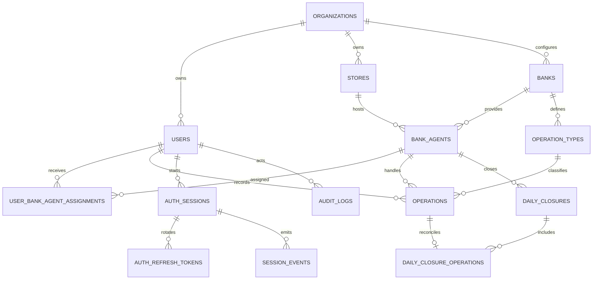

# Data Model: Autenticación y Línea Base Operacional

## Conventions

- InnoDB, `utf8mb4`, claves primarias `BIGINT UNSIGNED` internas y UUID público cuando se exponga ID.
- Timestamps `DATETIME(6)` en UTC; presentación `America/Lima`.
- Importes `DECIMAL(18,2)`, moneda ISO `CHAR(3)`; nunca punto flotante.
- FKs con `RESTRICT` para registros operacionales/auditoría. Catálogos usan `is_active` y
  `deactivated_at`; operaciones/cierres no tienen eliminación física.
- JSON de auditoría contiene snapshots sanitizados, nunca contraseñas ni tokens.

## Relationship Overview



## Identity And Access Tables (This Feature)

### organizations

| Column | Type | Rules |
|--------|------|-------|
| id | BIGINT UNSIGNED | PK |
| public_id | CHAR(36) | UNIQUE, non-sequential external ID |
| name | VARCHAR(160) | required |
| timezone | VARCHAR(64) | default `America/Lima` |
| is_active | BOOLEAN | default true |
| deactivated_at | DATETIME(6) | nullable |
| created_at/updated_at | DATETIME(6) | required |

MVP seeds exactly one active organization; this is ownership context, not full multi-tenancy.

### users

| Column | Type | Rules |
|--------|------|-------|
| id | BIGINT UNSIGNED | PK |
| public_id | CHAR(36) | UNIQUE |
| organization_id | BIGINT UNSIGNED | FK organizations, RESTRICT |
| username_normalized | VARCHAR(100) | required |
| email_normalized | VARCHAR(254) | required |
| password | VARCHAR(255) | Laravel hash |
| role | VARCHAR(40) | ADMINISTRADOR_PROPIETARIO or OPERADOR |
| status | VARCHAR(20) | ACTIVE or INACTIVE |
| deactivated_at | DATETIME(6) | nullable |
| deactivated_by | BIGINT UNSIGNED | nullable FK users, RESTRICT |
| deactivation_reason | VARCHAR(500) | nullable; required when inactive |
| created_at/updated_at | DATETIME(6) | required |

Constraints/indexes: UNIQUE `(organization_id, username_normalized)`, UNIQUE
`(organization_id, email_normalized)`, INDEX `(organization_id, role, status)`, CHECK status/reason
consistency. Application forbids self-deactivation and keeps at least one active owner administrator.

### auth_sessions

| Column | Type | Rules |
|--------|------|-------|
| id | BIGINT UNSIGNED | PK |
| public_id | CHAR(36) | UNIQUE; JWT `sid` |
| user_id | BIGINT UNSIGNED | FK users, RESTRICT |
| status | VARCHAR(20) | ACTIVE, EXPIRED, REVOKED |
| started_at | DATETIME(6) | required |
| access_expires_at | DATETIME(6) | required |
| absolute_expires_at | DATETIME(6) | started_at + 8 hours |
| last_refreshed_at | DATETIME(6) | nullable |
| ended_at | DATETIME(6) | nullable |
| end_reason | VARCHAR(40) | nullable; four spec values |
| ip_hash | BINARY(32) | nullable, minimized context |
| user_agent_summary | VARCHAR(255) | nullable, sanitized |
| created_at/updated_at | DATETIME(6) | required |

Indexes: `(user_id, started_at)`, `(user_id, status, started_at)`,
`(status, access_expires_at)`, `(absolute_expires_at)`. CHECK active/end-field consistency and
`access_expires_at <= absolute_expires_at`.

State transitions:

```text
ACTIVE -> ACTIVE   successful explicit refresh
ACTIVE -> EXPIRED  access or absolute limit reached
ACTIVE -> REVOKED  logout, administrative revocation, refresh reuse/security failure
terminal states do not transition
```

### auth_refresh_tokens

| Column | Type | Rules |
|--------|------|-------|
| id | BIGINT UNSIGNED | PK |
| auth_session_id | BIGINT UNSIGNED | FK auth_sessions, RESTRICT |
| token_hash | BINARY(32) | UNIQUE HMAC-SHA-256 |
| generation | INT UNSIGNED | starts at 1 |
| state | VARCHAR(20) | ACTIVE, CONSUMED, REVOKED |
| issued_at/expires_at | DATETIME(6) | required; expiry equals current access |
| consumed_at/revoked_at | DATETIME(6) | nullable |
| replaced_by_id | BIGINT UNSIGNED | nullable self FK, RESTRICT |
| created_at/updated_at | DATETIME(6) | required |

UNIQUE `(auth_session_id, generation)`, INDEX `(auth_session_id, state)`, INDEX `(expires_at)`.
At most one ACTIVE token is enforced transactionally while session row is locked. Consumed rows are
retained through absolute session expiry to detect replay.

### session_events

| Column | Type | Rules |
|--------|------|-------|
| id | BIGINT UNSIGNED | PK |
| auth_session_id | BIGINT UNSIGNED | nullable FK auth_sessions, RESTRICT; NULL for LOGIN_FAILED |
| user_id | BIGINT UNSIGNED | FK users, RESTRICT |
| type | VARCHAR(40) | LOGIN, REFRESHED, LOGOUT, EXPIRED, ADMIN_REVOKED, REFRESH_REUSE, LOGIN_FAILED |
| occurred_at | DATETIME(6) | required |
| context | JSON | sanitized metadata only |
| created_at | DATETIME(6) | required; no update/delete UI |

Indexes: `(auth_session_id, occurred_at)` where `auth_session_id IS NOT NULL`, `(user_id, occurred_at)`, `(type, occurred_at)`.

### audit_logs

| Column | Type | Rules |
|--------|------|-------|
| id | BIGINT UNSIGNED | PK |
| organization_id | BIGINT UNSIGNED | FK organizations, RESTRICT |
| actor_user_id | BIGINT UNSIGNED | nullable FK users, RESTRICT |
| action | VARCHAR(100) | required |
| entity_type | VARCHAR(100) | allowlisted morph name |
| entity_id | BIGINT UNSIGNED | required |
| before_values/after_values | JSON | sanitized snapshots |
| reason | VARCHAR(500) | nullable/required by action |
| occurred_at | DATETIME(6) | required |
| correlation_id | CHAR(36) | required |
| created_at | DATETIME(6) | required |

Indexes: `(entity_type, entity_id, occurred_at)`, `(actor_user_id, occurred_at)`,
`(organization_id, occurred_at)`, `(action, occurred_at)`. Append-only application permissions.

## Target Operational Model (Deferred Specifications)

These tables define compatibility targets only. They MUST NOT be migrated by this authentication
feature.

### stores

Organization FK, unique code/name per organization, address/location fields only as approved,
`is_active`, `deactivated_at`. Index `(organization_id, is_active)`.

### banks

Organization FK, code, name, `is_active`, `deactivated_at`; UNIQUE `(organization_id, code)`.

### bank_agents

Organization, store and bank FKs; operational code/terminal, `is_active`, dates. UNIQUE
`(organization_id, bank_id, operational_code)` and UNIQUE `(id, store_id)` for composite integrity.

### user_bank_agent_assignments

User and bank-agent FKs, `assigned_at`, `unassigned_at`, `is_active`, assigning user. Indexes
`(user_id, is_active)` and `(bank_agent_id, is_active)`. Application prevents overlapping duplicate
active assignment under lock.

### operation_types

Organization/bank FKs, code, name, cash direction (`IN`, `OUT`, `NEUTRAL`), `is_active`; no commission
or profit fields. UNIQUE `(bank_id, code)`.

### operations

Organization, store, bank-agent, operation-type and registering-user FKs; `amount DECIMAL(18,2)`,
`currency CHAR(3)`, `effective_at`, `recorded_at`, status, optional reference/observation, annulment
actor/time/reason and replacement link. No delete path.

Required indexes: `(user_id, effective_at)`, `(bank_agent_id, effective_at)`,
`(store_id, effective_at)`, `(operation_type_id, effective_at)`, `(status, effective_at)`, and
`(organization_id, effective_at)`. Composite FK `(bank_agent_id, store_id)` preserves location.

### daily_closures

Organization, store, bank-agent, business date, creator, status; opening/expected/counted/difference
as `DECIMAL(18,2)`, currency, timestamps and audit fields. UNIQUE active/final closure rule per
agent/date/currency enforced transactionally. No physical deletion.

### daily_closure_operations

Closure and operation FKs, attached timestamp/user. UNIQUE `(operation_id)` prevents assigning one
operation to multiple closures; UNIQUE `(daily_closure_id, operation_id)`.

## Aggregate Query Rules

- Use SQL `COUNT(*)`, `SUM(amount)` and conditional `SUM(CASE...)` grouped by requested period.
- Period boundaries are converted from `America/Lima` to UTC before filtering.
- Never hydrate all operations for totals. Reporting DTOs receive decimal strings/objects, not float.
- Every query starts with organization and authorization scope, then date/index-compatible filters.

## Migration Sequencing

1. `organizations`
2. `users`
3. `auth_sessions`
4. `auth_refresh_tokens`
5. `session_events`
6. `audit_logs`
7. Deferred by approved specs: stores/banks/agents/assignments/types, operations, closures/pivot

Each migration has a reverse order `down()`. Production rollback after data creation prefers a
forward fix; dropping audit/session records requires explicit backup and approval.
