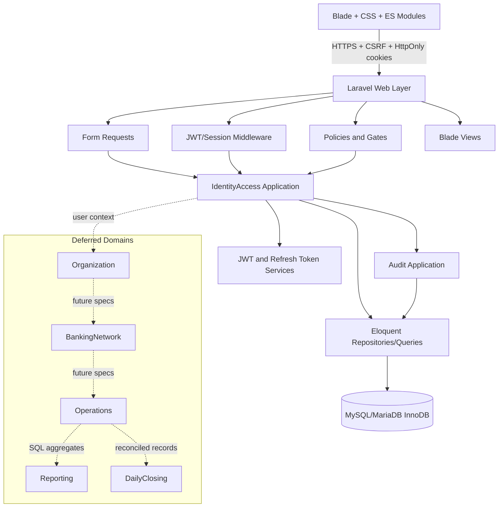

# Implementation Plan: Autenticación y Ciclo de Sesión

**Branch**: `001-auth-session` | **Date**: 2026-07-22 | **Spec**: [spec.md](./spec.md)

**Input**: Feature specification from `/specs/001-auth-session/spec.md`

## Summary

Construir el scaffold Laravel 13 y el módulo `IdentityAccess` de un monolito modular. El acceso se
autentica con JWT de cinco minutos en cookie segura y una credencial opaca de renovación, también en
cookie, cuyo hash se rota bajo transacción MySQL. Cada petición protegida valida JWT, sesión y usuario
en servidor para aplicar expiración, logout, reutilización, desactivación y límite absoluto de ocho
horas de forma inmediata. Blade y un ES Module muestran el tiempo restante sin leer tokens.

## Technical Context

**Language/Version**: PHP 8.3; JavaScript ECMAScript Modules; HTML5; CSS3

**Primary Dependencies**: Laravel 13, Eloquent, Blade, `lcobucci/jwt` 5.x, Vite solo en build;
Chart.js diferido solo en futuras páginas de gráficos y no cargado por esta capacidad

**Storage**: MySQL 8.0 o MariaDB compatible, InnoDB, migraciones Laravel, claves foráneas, checks e
índices; no Redis obligatorio

**Time & Money**: instantes persistidos en UTC y mostrados en `America/Lima`; montos futuros con
`DECIMAL(18,2)` y moneda `CHAR(3)`, nunca `float`/`double`

**Authentication & Session**: HS256 con clave dedicada; access JWT configurable, 300 segundos por
defecto; refresh opaco de 256 bits, HMAC-SHA-256 en base de datos, un solo uso y mismo vencimiento;
sesión máxima de ocho horas; cookies `HttpOnly`, `Secure`, `SameSite=Strict`; CSRF obligatorio

**Testing**: PHPUnit, pruebas Feature/Unit y suite de integración MySQL/MariaDB para bloqueos,
rotación, reutilización y carreras; pruebas de navegador para cookies, contador y visibilidad

**Target Platform**: Apache o Nginx sobre hosting PHP compartido con PHP 8.3, Composer, HTTPS,
MySQL/MariaDB y document root en `public/`

**Project Type**: aplicación web monolítica modular, renderizada en servidor

**Performance Goals**: al menos 95% de login, renovación y logout en <=2 s bajo carga interna;
historial siempre paginado; validación protegida con consultas indexadas y sin relaciones N+1

**Constraints**: sin SPA, sin dependencia obligatoria de Redis, sin WebSockets, workers permanentes ni microservicios,
contenedores requeridos ni Node.js en runtime; assets compilados antes de desplegar

**Scale/Scope**: una organización en MVP, múltiples tiendas/agentes y sesiones por usuario; el plan
define el modelo lógico global, pero esta especificación implementa solo Identity/Access y auditoría
necesaria para autenticación

## Constitution Check

*GATE: aprobado antes de Phase 0 y revalidado después de Phase 1.*

- **I. Desarrollo dirigido por especificaciones**: PASS. `spec.md` contiene problema, actores,
  historias, reglas, aceptación, límites y exclusiones; este documento concentra las decisiones HOW.
- **II. Entregas pequeñas**: PASS. La entrega implementa autenticación, sesiones, desactivación e
  historial. El modelo de otros dominios es diseño de referencia y sus migraciones quedan diferidas.
- **III. Portabilidad económica**: PASS. PHP 8.3, Laravel 13, Composer e InnoDB; no Redis, workers,
  WebSockets, Docker productivo ni Node.js en runtime; solo `public/` se expone.
- **IV. Interfaz mínima**: PASS. Blade, HTML semántico, CSS propio y ES Modules; no SPA. Chart.js no
  participa en esta capacidad.
- **V. Seguridad del servidor**: PASS. Middleware, Policies/Gates, Form Requests y scopes Eloquent
  imponen rol, propiedad y estado; HTTPS, throttling y hashing Laravel son obligatorios.
- **VI. Sesiones seguras**: PASS. JWT 5 min configurable, aviso 30 s, renovación explícita, refresh
  opaco rotatorio con hash, revocación y limpieza local están diseñados y contratados.
- **VII. Integridad y trazabilidad**: PASS. Sesiones, eventos y auditoría son append-oriented; no hay
  eliminación desde interfaz y las desactivaciones guardan before/after y motivo.
- **VIII. Exactitud monetaria/temporal**: PASS. UTC persistido, `America/Lima` visible y `DECIMAL` en
  el modelo futuro; esta capacidad no suma importes.
- **IX. Privacidad**: PASS. Solo identidad interna y metadatos mínimos; contraseñas y tokens nunca se
  registran, y no hay datos de clientes bancarios.
- **X. Pruebas obligatorias**: PASS. Se planifican casos positivos/negativos y ciclo completo,
  incluyendo expiración, rotación, replay, logout, revocación, concurrencia y usuario inactivo.
- **XI. Recursos responsables**: PASS. Historial paginado e indexado, consultas acotadas y agregación
  SQL para dominios futuros; no colecciones completas ni N+1.
- **XII. Observabilidad/recuperación**: PASS. Logs sanitizados, `/health`, debug off, backups y
  migraciones reversibles forman parte del despliegue.
- **XIII. Gobernanza**: PASS. No se solicita excepción. Spec, plan y diseño quedan trazables.

**Post-design re-check**: PASS. `research.md`, `data-model.md`, contratos y `quickstart.md` mantienen
todos los controles anteriores y no introducen componentes prohibidos.

## Logical Component Diagram



## Module Boundaries

- `IdentityAccess`: usuarios, credenciales, login, JWT, sesiones, refresh, logout, throttling,
  desactivación e historial autorizado.
- `Organization`: organización y tiendas; MVP fija una organización activa.
- `BankingNetwork`: bancos, agentes, asignaciones y tipos de operación.
- `Operations`: registro, consulta, estados y corrección no destructiva.
- `Reporting`: queries agregadas, periodos y proyecciones; sin sumar colecciones en PHP.
- `DailyClosing`: cierres y asociación inmutable de operaciones.
- `Audit`: escritura append-only de cambios sensibles y consultas autorizadas.

Los controladores solo coordinan Form Requests, acciones y respuestas. Las reglas viven en acciones
con nombres explícitos (`AuthenticateUser`, `RotateRefreshToken`, `RevokeSession`,
`DeactivateUser`, `ListAuthorizedSessions`) y servicios de dominio cuando una regla cruza entidades.

El diseño no incorpora clientes finales, comisiones, ganancias, APIs bancarias, conciliación,
aplicación móvil, microservicios ni multiempresa completa. `organizations` aporta pertenencia e
integridad para el único cliente del MVP; habilitar aislamiento multiempresa requerirá otra
especificación.

## Authentication And Session Flows

### Login

1. `LoginRequest` normaliza identificador y valida forma; el rate limiter evalúa identificador+origen.
2. `AuthenticateUser` bloquea/lee el usuario, verifica estado y hash Laravel sin mensajes reveladores.
3. En transacción se crea `auth_sessions`, refresh generation 1 y evento `LOGIN`.
4. `JwtIssuer` crea claims `iss`, `aud`, `sub`, `sid`, `jti`, `iat`, `nbf`, `exp`.
5. Se envían cookies host-only HttpOnly/Secure/SameSite Strict y se redirige a una vista que expone
   solo `expiresAt`.

### Explicit Renewal

1. El modal llama `POST /auth/refresh`; no existe llamada en carga inicial.
2. CSRF se valida antes de leer credenciales. Se calcula HMAC del refresh recibido.
3. La transacción bloquea `auth_sessions` y luego `auth_refresh_tokens` con `FOR UPDATE`.
4. Se validan usuario activo, sesión activa, access aún vigente, refresh activo, vencimientos y
   límite de ocho horas.
5. Si es válido, el token actual pasa a `CONSUMED`, se inserta la siguiente generación, se emite JWT,
   se registra `REFRESHED` y se confirma antes de devolver cookies y `expiresAt`.
6. Si ya fue consumido, se revoca la sesión como `FALLO_SEGURIDAD`, se registra `REFRESH_REUSE` y se
   responde 401. En carrera, una petición puede renovar y la segunda revoca toda la sesión.

### Authorization

1. Middleware valida algoritmo fijo, firma, issuer, audience y tiempos del JWT.
2. `sid` y `sub` se consultan con índices; sesión debe estar activa y usuario activo.
3. Policies/Gates aplican rol. `SessionPolicy` fuerza `user_id=current_user` para `OPERADOR`; la query
   aplica ese scope antes de filtros y paginación.
4. Blade solo refleja permisos ya decididos; ocultar controles no sustituye autorización.

### Frontend Timer

El ES Module calcula `max(0, expiresAt-Date.now())` cada segundo. En `visibilitychange` descarta el
conteo acumulado y recalcula desde `expiresAt`. A 30 s abre un modal accesible. `Continuar` deshabilita
el botón para single-flight, renueva explícitamente y reemplaza `expiresAt`; 401/403/419, cero o fallo
de seguridad limpian estado visual y navegan al login. Ningún token entra en JavaScript.

## Validation Strategy

- Form Requests: formato, longitud, normalización, motivo de desactivación, filtros y paginación.
- Acciones: invariantes de estado, expiración, límite absoluto, generación y transición atómica.
- Base de datos: unique, foreign keys, checks, enums respaldados por strings y precisión temporal.
- Middleware/Policies: autenticación y autorización negativa en todas las rutas protegidas.
- Respuestas: errores genéricos para login/refresh y `Cache-Control: no-store` en contenido sensible.

## Audit Strategy

- `session_events` registra `LOGIN`, `REFRESHED`, `LOGOUT`, `EXPIRED`, `ADMIN_REVOKED`,
  `REFRESH_REUSE` y fallos relevantes, sin token ni contraseña.
- `audit_logs` registra desactivación: actor, instante UTC, entidad, before/after JSON y motivo.
- Los eventos y auditorías no se editan ni eliminan desde la interfaz. La limpieza futura requiere
  política de retención independiente y nunca rompe detección de replay durante una sesión.
- Logs técnicos incluyen correlation ID, tipo de evento y session ID interno, con payload sanitizado.

## Testing Strategy

- Unit: claims/tiempo, HMAC, normalización, temporizador y transiciones puras.
- Feature: todos los escenarios de `spec.md`, roles positivos/negativos, CSRF, throttling, cookies,
  expiración, máximo 8 h, sesiones múltiples, historial y desactivación.
- Integration MySQL/MariaDB: dos conexiones para refresh concurrente, locks, replay, rollback,
  refresh-vs-logout y refresh-vs-deactivation; SQLite no valida estas pruebas.
- Browser: cookies no legibles, timer por segundo, modal a 30 s, visibility change, responsive y
  navegación a login.
- Security regression: algoritmo JWT fijo, claims inválidos, token manipulado, session mismatch,
  consulta de sesiones ajenas, secretos ausentes en logs.

## Migration Plan

1. Scaffold Laravel 13 y configuración base UTC/`America/Lima`, HTTPS, logging y `/health`.
2. Crear `organizations` y ampliar/crear `users` porque IdentityAccess requiere propietario lógico.
3. Crear `auth_sessions`, `auth_refresh_tokens`, `session_events` y `audit_logs` con FKs e índices.
4. Sembrar organización única y primer `ADMINISTRADOR_PROPIETARIO` mediante entrada segura.
5. Implementar y verificar autenticación antes de activar middleware sobre rutas futuras.
6. Diferir migraciones de stores, banking, operations y closings a sus especificaciones; su modelo
   objetivo se conserva en `data-model.md` para evitar incompatibilidades.

Todas las migraciones de esta entrega tienen `down()` inverso. Antes de rollback productivo se
exportan base y archivos necesarios; una migración con datos debe separar expansión, backfill y
restricción para permitir despliegue seguro.

## Shared Hosting Risks

- PHP 8.3/Laravel 13 o extensiones OpenSSL/Sodium ausentes: verificar antes de provisionar.
- Document root no configurable: hosting no apto; no mover `index.php` fuera de `public/`.
- Reloj desincronizado: exigir NTP del proveedor y monitorear desviación.
- Sin comandos scheduler confiables: expiración se aplica en cada request y no depende de cleanup.
- Límites bajos de CPU/conexiones: consultas indexadas, páginas acotadas y transacciones breves.
- Sin acceso a variables de entorno: usar `.env` fuera de publicación con permisos mínimos; nunca
  incluir claves en repositorio.

## Deployment Procedure

1. Verificar PHP/extensiones, Composer, MySQL/MariaDB, HTTPS, cron opcional y document root `public/`.
2. Respaldar base de datos y archivos persistentes; probar restauración en staging.
3. Ejecutar `composer install --no-dev --optimize-autoloader` fuera o dentro del hosting permitido.
4. Compilar assets en CI/build con Vite (`npm ci && npm run build`) y subir `public/build`; producción
   no instala Node.js.
5. Configurar claves separadas para app, JWT y HMAC refresh; cookies Secure y debug false.
6. Activar modo mantenimiento, ejecutar `php artisan migrate --force`, caches Laravel y smoke tests.
7. Desactivar mantenimiento y validar `/health`, login, renovación, logout y logs sanitizados.

## Rollback Strategy

1. Detener tráfico o activar mantenimiento y conservar evidencia del fallo.
2. Revertir release y assets a la versión anterior compatible.
3. Ejecutar `migrate:rollback` solo si no destruye datos posteriores; preferir forward fix cuando ya
   existen sesiones/eventos productivos.
4. Restaurar backup si la compatibilidad de datos no puede preservarse y documentar pérdida máxima.
5. Rotar claves si el incidente pudo exponer secretos; revocar todas las sesiones afectadas.
6. Ejecutar health/smoke tests y registrar causa, decisión y responsable.

## Project Structure

### Documentation (this feature)

```text
specs/001-auth-session/
├── plan.md
├── research.md
├── data-model.md
├── quickstart.md
├── contracts/
│   └── web-endpoints.md
└── tasks.md
```

### Source Code (repository root)

```text
app/Modules/
├── IdentityAccess/
│   ├── Application/Actions/
│   ├── Domain/Enums/
│   ├── Http/Controllers/
│   ├── Http/Requests/
│   ├── Models/
│   ├── Policies/
│   └── Services/
├── Organization/
├── BankingNetwork/
├── Operations/
├── Reporting/
├── DailyClosing/
└── Audit/
app/Http/Middleware/
config/auth.php
config/session-security.php
database/migrations/
database/factories/
database/seeders/
resources/views/identity-access/
resources/js/identity-access/session-timer.js
resources/css/app.css
routes/identity-access.php
routes/web.php
tests/Feature/IdentityAccess/
tests/Integration/IdentityAccess/
tests/Unit/IdentityAccess/
```

**Structure Decision**: Un solo Laravel desplegable con módulos por dominio bajo `app/Modules`.
IdentityAccess y Audit se implementan ahora; los demás límites se reservan sin crear funcionalidad o
tablas hasta que una especificación aprobada las requiera.

## Exception Tracking

No hay excepciones constitucionales.
