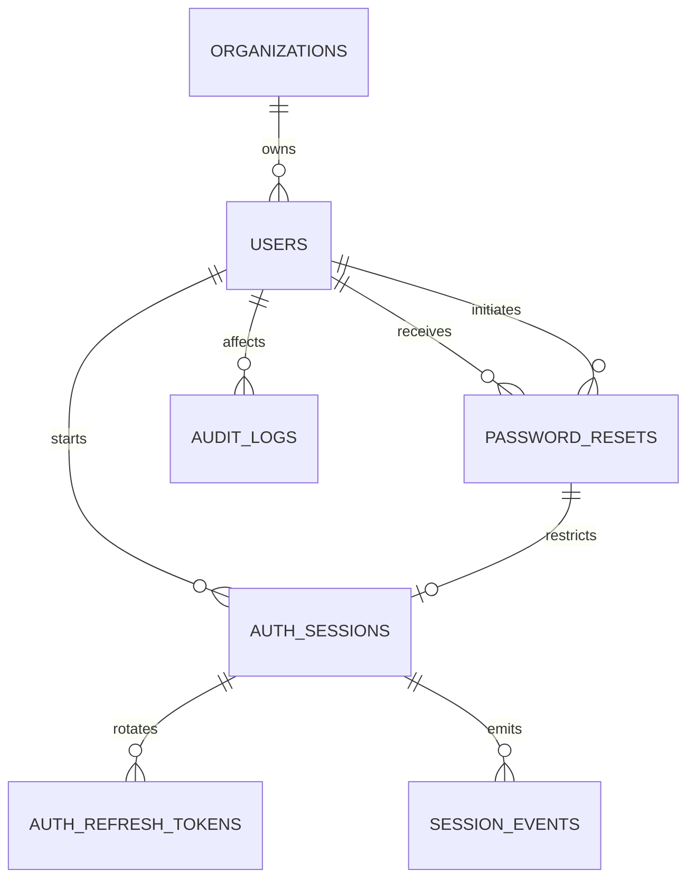

# Data Model: Restablecimiento Seguro de Contraseña

## Conventions

- MySQL/MariaDB InnoDB; PK internas `BIGINT UNSIGNED`; UUID público cuando una entidad se expone.
- Instantes `DATETIME(6)` consistentes; presentación en `America/Lima`.
- FKs `RESTRICT`; no existe eliminación desde la interfaz.
- Estados representados por enums PHP respaldados por strings.
- Ninguna tabla nueva conserva contraseña temporal legible ni un segundo hash.
- JSON de auditoría usa snapshots sanitizados de estados e instantes.

## Relationship Overview



## New Entity: `password_resets`

| Column | Type | Rules |
|--------|------|-------|
| id | BIGINT UNSIGNED | PK |
| public_id | CHAR(36) | UNIQUE; UUID |
| organization_id | BIGINT UNSIGNED | FK organizations, RESTRICT |
| user_id | BIGINT UNSIGNED | FK users, RESTRICT; target operator |
| initiated_by_user_id | BIGINT UNSIGNED | FK users, RESTRICT; administrator |
| status | VARCHAR(20) | enum below |
| issued_at | DATETIME(6) | required |
| expires_at | DATETIME(6) | required; `issued_at + 3600 s` |
| consumed_at | DATETIME(6) | nullable |
| completed_at | DATETIME(6) | nullable |
| superseded_at | DATETIME(6) | nullable |
| reason | VARCHAR(500) | nullable |
| created_at/updated_at | DATETIME(6) | required |

Indexes:

- UNIQUE `(public_id)`
- INDEX `(user_id, status, issued_at)`
- INDEX `(organization_id, status, issued_at)`
- INDEX `(expires_at)`
- INDEX `(initiated_by_user_id, issued_at)`

The application enforces at most one `PENDING` or `CONSUMED` reset per user while holding the user
row lock. A portable partial unique index is not assumed across MySQL/MariaDB.

### `PasswordResetStatus`

| State | Meaning |
|-------|---------|
| `PENDING` | Temporary hash issued, not expired and not consumed |
| `CONSUMED` | First successful login created the linked restricted session |
| `COMPLETED` | Definitive password accepted and restriction removed |
| `SUPERSEDED` | A later administrative reset replaced this lifecycle |
| `EXPIRED` | One-hour boundary reached before consumption |

State transitions:

```text
PENDING  -> CONSUMED    first successful temporary login
PENDING  -> SUPERSEDED  newer reset
PENDING  -> EXPIRED     now >= expires_at
CONSUMED -> COMPLETED   valid definitive password
CONSUMED -> SUPERSEDED  new reset after restricted session loss/logout/expiry
terminal states do not transition
```

## Modified Entity: `users`

No new column is required.

- `password` holds the only current hash. During `PENDING` and `CONSUMED`, it is the temporary hash;
  after completion it becomes the definitive hash.
- `password_changed_at=null` preserves the existing forced-change mechanism.
- The current reset, not this nullable field, decides one-time use, expiry and restricted-session
  ownership.
- Eligibility remains `role=OPERADOR` and `status=ACTIVE`. Any present or future non-active status,
  including blocked, is rejected without adding a `BLOCKED` state in this feature.

## Modified Entity: `auth_sessions`

Add:

| Column | Type | Rules |
|--------|------|-------|
| password_reset_id | BIGINT UNSIGNED | nullable FK password_resets, RESTRICT, UNIQUE |

- Null means normal session or existing initial-password flow.
- Non-null means the one restricted session created by consuming that reset.
- Existing rows remain null; no backfill.
- The unique constraint is a second guard against concurrent double consumption.

The reset revokes all target sessions active before issuance. A restricted session remains governed
by the existing `ACTIVE -> EXPIRED/REVOKED` lifecycle and refresh rotation.

## Existing Entity: `auth_refresh_tokens`

No schema change.

- All `ACTIVE` tokens belonging to sessions revoked by a reset become `REVOKED` with
  `revoked_at=now`.
- The restricted session receives generation 1 through the existing service and may rotate only by
  explicit renewal.

## Existing Entity: `session_events`

No schema change; extend the backed enum values as needed:

- `PASSWORD_RESET_REVOKED`: an existing target session was revoked by issuance.
- `PASSWORD_RESET_LOGIN`: a reset was consumed and a restricted session started.
- Existing `LOGIN`, `REFRESHED`, `LOGOUT`, `EXPIRED` remain applicable.

No secret, hash, admin password, raw IP or reset response is included in context.

## Existing Entity: `audit_logs`

No schema change. Use `entity_type=IdentityAccess User`, `entity_id=target user id`.

Actions:

| Action | Before/after content |
|--------|----------------------|
| `password_reset.issued` | prior/current lifecycle state, reset public ID, timestamps |
| `password_reset.superseded` | reset public ID and state transition |
| `password_reset.sessions_revoked` | count and reason only |
| `password_reset.consumed` | reset public ID, state, linked session public ID |
| `password_reset.expired` | reset public ID, state and expiry time |
| `password_reset.completed` | reset public ID, state and completion time |

`actor_user_id` is the administrator for issuance/supersession and the operator for
consumption/completion. Expiry discovered by an unauthenticated login uses the system actor
representation supported by the audit module; expiry discovered by an authenticated administrative
query attributes the initiator while retaining an automatic-expiry result. Query access is
restricted to an administrator of the same organization and is paginated.

## Transaction Boundaries And Lock Order

### Issue/reset

1. Reauthenticate administrator; authorize role, organization and target.
2. Begin transaction; lock target `users` row.
3. Revalidate target `OPERADOR/ACTIVE`.
4. Lock non-terminal password resets; mark prior lifecycle `SUPERSEDED`.
5. Update target password hash and `password_changed_at`.
6. Insert `PENDING` reset.
7. Lock target active sessions in ID order; revoke their refresh tokens and sessions.
8. Append session events and audit; commit.
9. Only after commit, return the in-memory secret.

### Consume/login

1. Begin transaction; lock target user.
2. Lock newest non-terminal reset and check hash, state and `now < expires_at`.
3. If expired, persist `EXPIRED`, append `password_reset.expired` and return a generic failed result
   after commit.
4. If valid, create session + refresh with `password_reset_id`.
5. Change reset to `CONSUMED`, append events/audit and commit.

### Complete

1. Lock current auth session, its reset and user in consistent order.
2. Require active linked session and reset `CONSUMED`.
3. Validate new value/confirmation and require the new value not to match the current temporary
   hash; do not request the already-consumed temporary plaintext again.
4. Update definitive hash/`password_changed_at`, mark `COMPLETED`, audit and commit.

## Migration And Recovery

- Migration 1 creates `password_resets`.
- Migration 2 adds nullable unique `auth_sessions.password_reset_id`.
- `down()` drops the FK/index/column before dropping the new table.
- No backfill or data rewrite is required.
- Production rollback with lifecycle data requires backup/export; prefer forward fix rather than
  discarding security history.
